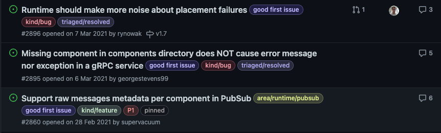
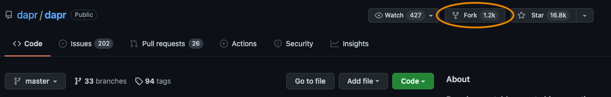

Contributing to open source can be daunting. Maybe you are afraid 
that everyone can see your code and can criticize it, or that your 
pull request is not excepted. You need to keep in mind that open
source projects are usually community driven and managed by a single or
some maintainers. Mostly all projects are following a code of conduct, which
ensures a respectful atmosphere for everybody.

## Selecting a Project

The selection of a project for your first contribution can be overwhelming,
but you probably have used many open source projects already. 

 - You are using it
 - The project is actively maintained

Okay you have chosen a project, then you should start by checking if the 
project has a `CONTRIBUTING.md`, like 
[this](https://github.com/dapr/dapr/blob/master/CONTRIBUTING.md) for example. 

This document describes how to start contributing for this particular project,
this can be different between projects. Some projects require that you sign off 
every commit to signalize that you read and your commit fulfills the 
[Developer Certificate of Origin](https://developercertificate.org/) (DCO).

## Selecting an Issue

Starting your contribution by checking the currently open issues or even better
by improving the documentation. Contribution that are improving the documentation
are usually always welcome and help new users of the project. 

As you can see in this exemplary issues of a project on GitHub, usually issues
are getting triaged by maintainers. During triage, issues are assigned
priorities and label by complexity or even sometimes issues are marked
especially good for beginners.

## Forking the Repository

You need to fork a repository, that you don't have push rights to, to contribute. 
Forking creates a copy of the repository, including all history under your ownership.
On GitHub, you can easily fork any repository by clicking the fork button.

In this copy, you can freely commit changes and create branches. I would now create
a new branch to commit my changes and try to use a branch name that represents that
I am working on, e.g. `fix/2896-placement`. This show clearly that I am doing a fix
for issue 2896 affecting placement.

## Open a Pull-Request

You committed **all** your changes and made sure that the code works, including tests if 
necessary and it is commented, then you can open a pull request. A pull requests presents
your changes to maintainers and everybody else publicly and allows everyone to review
and ask questions regarding your changes. Therefore, double check that you followed the
contribution guidelines. After committing your code, GitHub shows a compare & pull request
button in your forked repository.

This directly opens an often pre-filled pull request. Every pull requests should include 
a short verbal description of what and why you changed something, maybe also if this change
is a breaking change. It is also possible to add pictures to show changes in graphical user
interface or website. Remember that you are communicating with people, be polite and open
for discussion and accept feedback, because there is always room to improve.

It can take some time until your pull request is accepted or even closed. Maintainers are 
doing the review typically in their private free time, probably like you did your contribution. 
Even as a non maintainer, you can review other open pull requests to speed up the process.

When your pull request is accepted, you can be happy that some changes or code made by can be
used freely to create awesome software! And now start working on your next issues and keep 
improving and contributing to open source software. I hope this short this description helped 
you to do your first contribution.