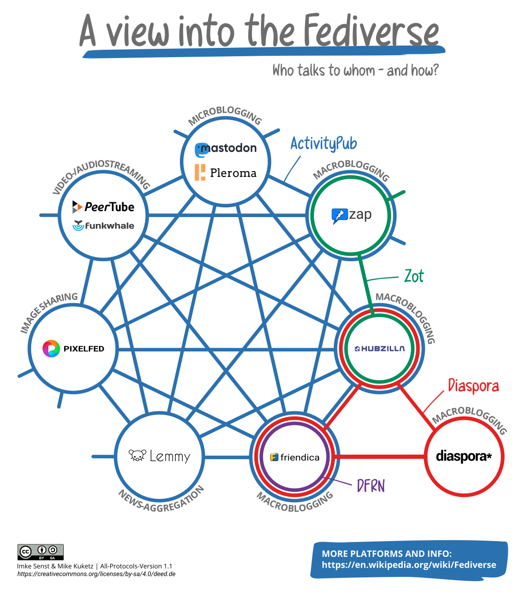

Social media platform are owned by big companies and billionaires, and they are using algorithms to ensure we stay as long as possible on these platforms.
Because they want to maximize advertisements profit and collect much data about us,
to even better target advertisements or sell this information to third parties.

To solve this, social media can not be profit driven and needs to be in the hands of **the people**
and not run by corporate interests. Social media should use interoperable communication protocols,
like when using email. You can choose your provider, but can communicate with everyone. Platforms, like
Twitter or Facebook, create artificial barriers, because of corporate interests! **Fediverse to the rescue.**

## What is the Fediverse?

Fediverse, is word combination out of federation and universe. It is federated, interconnected, network servers that
are used for all kinds of publishing, e.g. images, videos or microbloggs. These servers are using a common W3C
standardized protocol [ActivityPub](https://en.wikipedia.org/wiki/ActivityPub).

_Source: [Imke Senst, Mike Kuketz](https://en.wikipedia.org/wiki/Fediverse#/media/File:How-the-Fediverse-connects.png)_

### Activity Pub

Activity Pub describe the communication protocol used to federate different instances. This protocol can be seen like
sending json via email, including some standardized actions how to signalize, flow and unflow etc.

In the activity pub definition user are called actors and these are identified as @user@instance, comparable to email.
This identifier identifies the user and the instance is used by the user. For this user the instances stores a private inbox
and a public outbox. Everyone, if not filtered or blocked, can send messages to inboxes of users. This happens, for example, when
you follow a user one different instance. His instance can push new messages into your inbox and your instance can also pull from
the public outbox.

#### Security

Activity Pub doesn't use end-to-end encryption. **Do not use it to communicate private messages!**
Furthermore, instance administrators can read all messages and could impersonate users from his administered instances.
This is again comparable to email, origin of a message
and content is not always cryptographically secured.

For secure one to one communication use an end-to-end encrypted messenger, like [signal](https://signal.org/).

## Mastodon

Mastodon is a microblogging platform in the Fediverse. It has Twitter like features of sending short messages without any algorithms deciding
what you should read or advertisements. There are many mastodon instances you can freely choose from. Every instance has it own rules and moderation.
You can find a list of different instances, including some information about each [here](https://joinmastodon.org/servers).

### How to choose an Mastodon instance?

Do not be afraid of choosing a wrong instance, you can always [move to another instances](https://mastodon.social/@Gargron/103393780267601137).

Choosing an instance affects which messages you will receive automatically, but you can always follow users from different instances to create a timeline
that fits your interests. Therefore, choose in instance that has your language and the rules reflect your mindsets. Then you can easily get in contact with like
minded peoples.

Messages, also known as toots, send by users using the same instance, will be visible in local timeline. The local timeline is a good place to get in contact with users
from your instance. In the federated timeline all toots received from your instance from federated instance are shown, this can sometime be quite noisy and there is no
guarantee that all toots are shown. If you want to make sure to get toots from users you should follow them, this ensures that toots from them are show in your home or
personal timeline.

### Problems of Mastodon

You can not follow topics or tags. You can search for them, but this only includes toots known by your instance. For example, you are interested in the tag #golang,
because you love the go programming language. And somebody posted a cool toot about golang and includes this hashtag in toot on a instance that is not federate with your instance
you will never see this toot. Furthermore, when you follow someone you will get all his toots including his food or pet pictures you do not care about, because there are no
algorithms organizing your timeline. It is unfiltered and chronology ordered.

Give mastodon a try! And try not use a large instance, because we want to be decentralized, resistent to influence.
